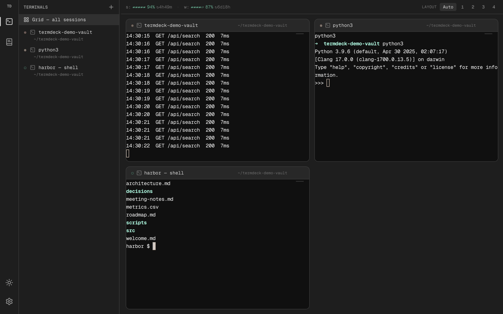
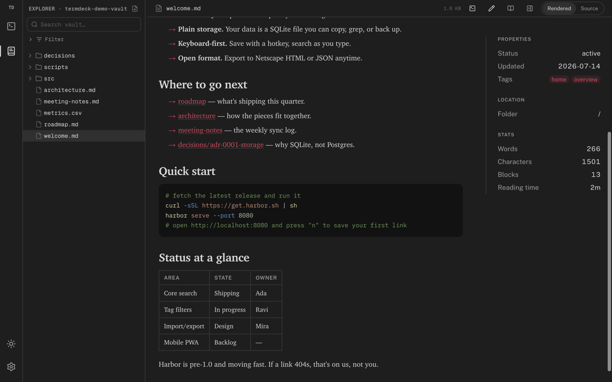
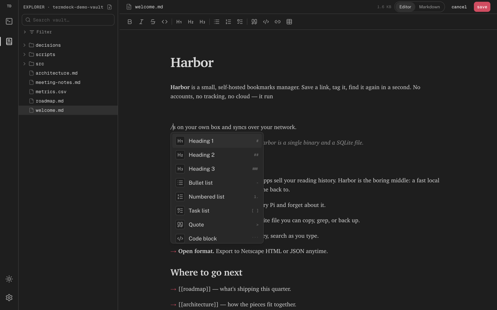
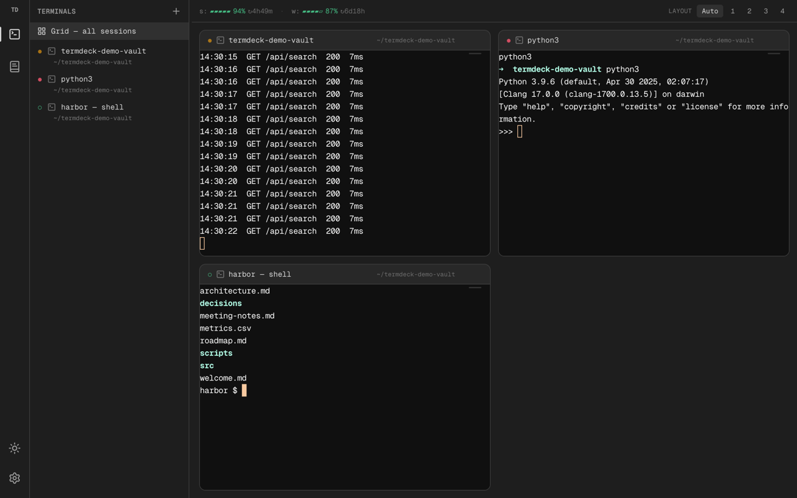

# TermDeck

**The deck your agents work on.**

**Product page: [termdeck.huytieu.com](https://termdeck.huytieu.com)**

<p align="center">
  
</p>

<p align="center">
  
</p>

TermDeck is a browser-native workspace that fuses two things: a terminal multiplexer where **every tab is a shell**, and a **Markdown knowledge workspace** for reading and writing the notes those shells live next to. Run agents in the terminal on the left, read and edit the docs they touch on the right — same tab, same tool, reachable from any device on your tailnet.

> **TermDeck is a fork of [localterm](https://github.com/monotykamary/localterm)** (MIT, by [@monotykamary](https://github.com/monotykamary)) — all of the terminal foundation is its work. The knowledge/wiki workspace is inspired by [anh-chu/wiki-viewer](https://github.com/anh-chu/wiki-viewer). See [Credits](#credits).

---

## What you get

### Terminal — shell = browser tab _(from localterm)_

- **New tab → new shell.** Close a tab and its shell waits in the session switcher for a short grace window; a shell still producing output or running a foreground program is never reaped mid-command.
- **Live grid** of every session as interactive tiles, a fast session switcher, and reattach-on-reconnect.
- Reachable over your **tailnet** (`https://<node>.ts.net`), a portless local alias, or loopback — no `/etc/hosts` edits.

**TermDeck additions to the terminal:**

- **At-a-glance session status.** A minimal colored glyph per session: `●` amber = running, `●` coral = needs your input, `○` green = idle/done — so you can scan which agent needs you. The same glyph rides along on each **grid tile header**, so the live grid speaks the same status language as the sidebar.
- **Hover-to-kill.** A small `✕` on each session row; no trip to the grid.
- **Claude usage quota in the header.** Session (5h) and weekly limits with a bar, % remaining, and reset countdown — read from the same source your statusline uses.

### Wiki — a reading & writing workspace for your vault _(TermDeck)_

- **Browse your vault** as a file tree with persistent expand/collapse, extension filters, hide-dotfiles, and full-text search.
- **A reading surface, not a file dump.** Serif reading typography, a centered measure, a coral accent, and a right-hand info panel (Properties / Location / Stats — word count, blocks, reading time computed live). Toggle **reading mode** to hide all chrome.
- **WYSIWYG editor**, Notion/Obsidian style — headings, lists, tasks, tables, code, links — with a faithful Markdown round-trip (frontmatter preserved verbatim, `[[wikilinks]]` intact). Type **`/`** for a block-insert menu (headings, lists, quote, code block, table, divider) with keyboard nav, or use inline Markdown shortcuts. Flip to raw Markdown source anytime.
- **New note** in a click (defaults to `.md`), `[[wikilinks]]`, inline color swatches for hex/rgb values, and syntax-highlighted code (light/dark).
- **Mermaid everywhere.** ` ```mermaid ` fences render as live, theme-aware diagrams in every markdown surface — wiki, file previews, agent logs, canvas cards.
- Light and dark themes across the whole app, with one shared toggle.

### Click-to-preview — every file path in output is a link _(TermDeck)_

- Your agent prints `report.md`, `dashboard.html`, `src/search.ts:42` — click any of them and the file opens **rendered** in a drawer beside the terminal: Markdown with typography, code syntax-highlighted and jumped to the line, CSV as tables, images, PDFs, HTML as the actual page. The terminal stays mounted.
- Works for **any program's output** (git, pytest, ls) — it's the terminal linkifying, not the agent.
- GitHub issue/PR links render as fetched markdown in the same drawer; remote deploy links preview framed through a same-origin proxy.

### Tweak mode — point at the pixel, the agent gets the selector _(TermDeck)_

- Toggle **Tweak** on any rendered HTML (vault file or proxied deploy) and the page becomes an element picker: click the element, type what should change.
- **Send now** dispatches one structured tweak (robust CSS selector + element snippet + your note) straight into the linked terminal session; **Add to batch** stacks several and sends them as one message.
- Text selections in any rendered doc get the same treatment ("chat about this").

### Canvas — an infinite whiteboard, offline _(TermDeck)_

- A third mode built on the [tldraw](https://tldraw.dev) SDK: fully offline (assets bundled, document in IndexedDB), theme-synced with the rest of the app.
- **Paste-aware:** mermaid source becomes a live diagram shape; a Markdown doc becomes a rendered card — tables, code, and embedded ` ```mermaid ` charts included. Double-click any shape to edit its source in place.
- tldraw's SDK license applies for production use; a free hobby license covers personal setups (`localStorage.setItem("termdeck:tldrawLicense", "<key>")`).

---

## Quickstart

```bash
git clone https://github.com/huytieu/termdeck-localterm
cd termdeck-localterm
pnpm install
pnpm build
pnpm start          # boots the daemon and serves TermDeck
pnpm cli status     # shows the active URL
```

Open the URL `pnpm cli status` prints (loopback works with zero setup: `http://localterm.localhost:3417`). `pnpm stop` stops the daemon.

The mental model is **shell = browser tab**; switch to Wiki mode from the left rail to browse and edit your Markdown vault. Full docs live in [`docs/`](docs/).

---

## Screens

| Reading view | WYSIWYG + `/` menu | Live terminal grid |
| --- | --- | --- |
|  |  |  |

The full product page with per-feature demo GIFs is live at **[termdeck.huytieu.com](https://termdeck.huytieu.com)** (source: [`landing/`](landing/)).

---

## Credits

TermDeck stands on other people's work and says so:

- **[localterm](https://github.com/monotykamary/localterm)** by [@monotykamary](https://github.com/monotykamary) — the entire terminal foundation (session model, daemon, tailnet serve, grid). TermDeck is a fork of it.
- **[anh-chu/wiki-viewer](https://github.com/anh-chu/wiki-viewer)** — the inspiration for the in-app Markdown wiki workspace.

- **[tldraw](https://tldraw.dev)** — the canvas SDK behind Canvas mode (its SDK license applies for production use).

TermDeck's own additions: the memo-style reading view, the WYSIWYG editor (with the `/` block-insert menu), the file-tree filters + persistence + new-file flow, session status glyphs (sidebar **and** grid tiles), hover-kill, the usage-quota header, clickable file paths → artifact drawer, tweak mode with batched element feedback, and the paste-aware offline canvas.

## License

[MIT](LICENSE) — inherited from localterm. The original copyright and license are preserved unchanged; TermDeck's additions are MIT as well.
